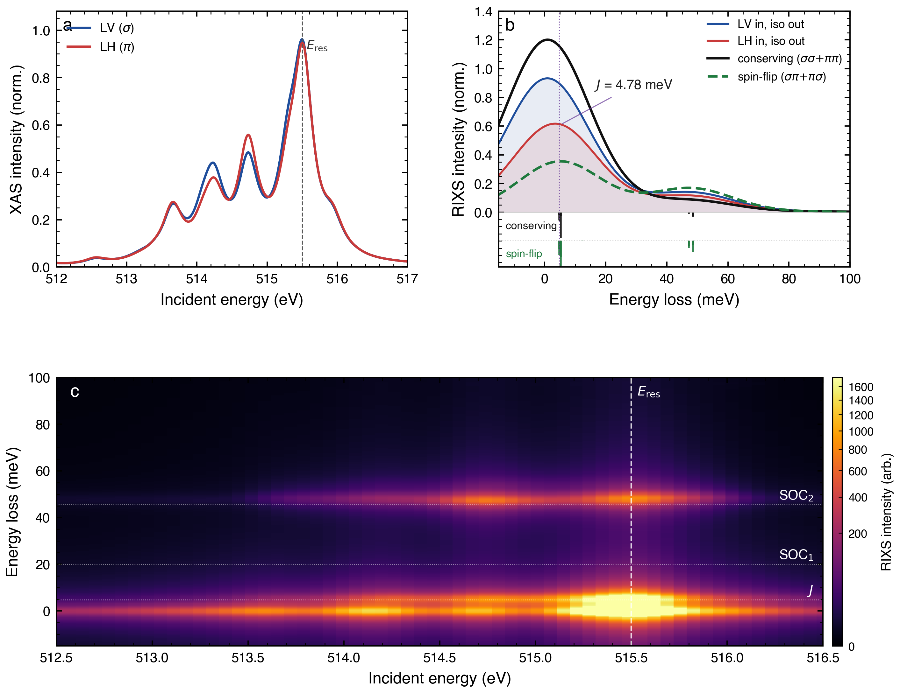

# Two-site V⁴⁺ cluster: exact-diagonalisation RIXS at the V L₃ edge

[](https://nsls-ii.github.io/edrixs/)
[](https://www.python.org/)

Exact Kramers–Heisenberg RIXS calculation on a two-site V⁴⁺–V⁴⁺ cluster
at the V L₃ edge (~515 eV), with parameters appropriate for the
pyrochlore Y₂V₂O₇.  The calculation is fully *ab initio* within the
cluster: no phenomenological peaks, no projected pseudospins — every
feature in the output spectrum emerges from exact diagonalisation of
the full 24 spin-orbital Hamiltonian.

<p align="center">
  
</p>

## What the calculation does

- Builds the full 3d + 2p Slater–Coulomb + SOC + crystal-field + inter-site
  hopping Hamiltonian in the real cubic basis (via **edrixs**).
- Diagonalises the initial (2-electron) and intermediate (3-electron,
  one core hole per site) Hamiltonians.
- Computes the Kramers–Heisenberg scattering amplitude at resonance with
  full Cartesian polarisation control → σσ, σπ, πσ, ππ channels.
- Produces XAS, polarisation-resolved RIXS line cuts, and a 2D RIXS
  incident-energy map, with instrument broadening applied.

The singlet–triplet splitting J ≈ 8 meV is **not** put in by hand — it
emerges as an eigenvalue gap of the full cluster Hamiltonian.

## Parameters (Y₂V₂O₇-like)

| symbol | value | meaning |
|---|---|---|
| ζ_d | 30 meV | V 3d spin–orbit coupling |
| Δ_trig | 10 meV | D₃d trigonal splitting within t₂g |
| U | 3.0 eV | d–d Hubbard U |
| J_H | 0.68 eV | Hund's coupling |
| F², G¹, G³ (pd) | edrixs × 0.8 | 2p–3d Slater integrals (atomic × 80 %) |
| U_dc | 4.0 eV | static 2p core-hole → 3d attraction |
| t | 77 meV | inter-site diagonal t₂g–t₂g hopping |

All parameters are collected at the top of `generate_dimer_pure.py` and
can be edited directly.

## Running the calculation

```bash
# one-time setup
conda create -n edrixs_run python=3.10
conda activate edrixs_run
pip install edrixs numpy scipy matplotlib

# reproduce the figures
python generate_dimer_pure.py
```

Runtime is ~30 s on a laptop (two 1320×1320 dense diagonalisations
dominate).  Outputs land in `Figures/`:

- `fig_dimer_pure.{pdf,png}` — low-energy publication view (XAS +
  RIXS line cut + 2D map, 0 → 100 meV)
- `fig_dimer_pure_highE.{pdf,png}` — same layout extended to 6 eV,
  showing the d–d multiplet structure

## Hilbert space

| state        | basis                          | dimension |
|--------------|--------------------------------|-----------|
| initial      | C(12, 2) × C(12, 12)           | 66 |
| intermediate | C(12, 3) × C(6, 5) × C(6, 6)   | 1320 |

Orbital layout (24 spin-orbitals): `[0:6]` t₂g site A, `[6:12]` t₂g site
B, `[12:18]` 2p core site A, `[18:24]` 2p core site B.

## Figure panels

- **a** — XAS for LV (σ) and LH (π) incidence, 512 → 517 eV
- **b** — RIXS at resonance (LV-in / LH-in, isotropic out), with
  unbroadened sticks overlaid
- **c** — 2D RIXS incident-energy map, 512 → 517 eV, with feature
  labels (J = singlet–triplet gap, SOC₁,₂ = d–d excitations that track
  E_res)

## Further reading

- Full walkthrough of the physics, the Hamiltonian construction, and a
  comparison with single-ion and Anderson-impurity workflows:
  [`CALCULATION.md`](CALCULATION.md).
- The edrixs two-site example this script follows:
  [`Ba3InIr2O9/t2g_two_site_cluster`](https://github.com/NSLS-II/edrixs/tree/master/examples/more/RIXS/Ba3InIr2O9/t2g_two_site_cluster).
- A Cluster-Anderson extension of the same model (shared bridging-O
  bath, covalency and charge-transfer satellites) lives in the companion
  repository
  [`topological-magnons-Y2V2O7/paper/vv_dimer_anderson_Y2V2O7`](https://github.com/liamlts/topological-magnons-Y2V2O7/tree/main/vv_dimer_anderson_Y2V2O7).

## Citation

If this calculation is useful in your work, please cite **edrixs**:

> Y. L. Wang, G. Fabbris, M. P. M. Dean, G. Kotliar. *EDRIXS: An
> open source toolkit for simulating spectra of resonant inelastic
> x-ray scattering*. Comput. Phys. Commun. **243**, 151 (2019).

## License

MIT.
